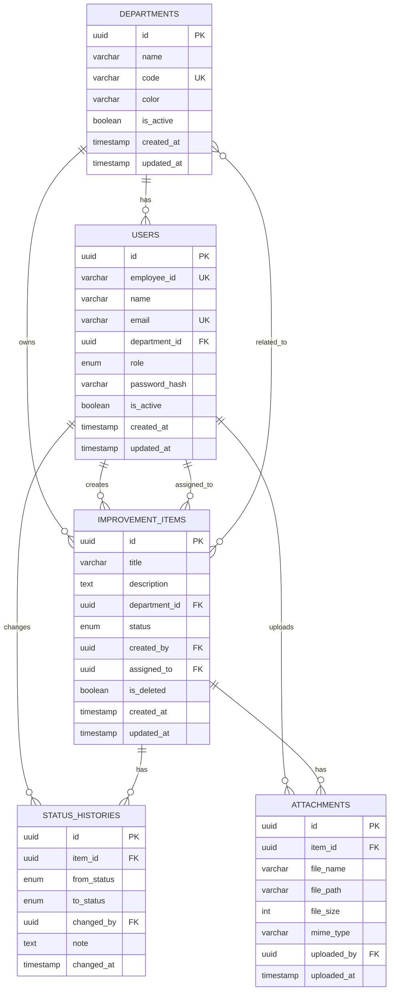

# ERD (Entity Relationship Diagram)
## 업무 개선 보드 시스템

---

## 데이터베이스 ERD

---

## 엔티티 설명

### DEPARTMENTS (부서)
| 컬럼 | 타입 | 설명 |
|------|------|------|
| id | UUID | 부서 ID (PK) |
| name | VARCHAR(50) | 부서명 |
| code | VARCHAR(20) | 부서 코드 (UK) |
| color | VARCHAR(7) | 부서 대표 색상 |
| is_active | BOOLEAN | 활성화 여부 |

### USERS (사용자)
| 컬럼 | 타입 | 설명 |
|------|------|------|
| id | UUID | 사용자 ID (PK) |
| employee_id | VARCHAR(20) | 사번 (UK) |
| name | VARCHAR(50) | 이름 |
| email | VARCHAR(100) | 이메일 (UK) |
| department_id | UUID | 소속 부서 (FK) |
| role | ENUM | 역할 (EMPLOYEE, DEPT_MANAGER, EXECUTIVE, ADMIN) |

### IMPROVEMENT_ITEMS (개선 항목)
| 컬럼 | 타입 | 설명 |
|------|------|------|
| id | UUID | 항목 ID (PK) |
| title | VARCHAR(100) | 제목 |
| description | TEXT | 상세 설명 |
| status | ENUM | 상태 (IDEA, REVIEWING, IN_PROGRESS, ON_HOLD, DONE) |
| created_by | UUID | 등록자 (FK) |
| is_deleted | BOOLEAN | 삭제 여부 (소프트 삭제) |

### STATUS_HISTORIES (상태 이력)
| 컬럼 | 타입 | 설명 |
|------|------|------|
| id | UUID | 이력 ID (PK) |
| item_id | UUID | 항목 ID (FK) |
| from_status | ENUM | 이전 상태 |
| to_status | ENUM | 변경 상태 |
| changed_by | UUID | 변경자 (FK) |
| note | TEXT | 변경 메모 |

### ATTACHMENTS (첨부파일)
| 컬럼 | 타입 | 설명 |
|------|------|------|
| id | UUID | 첨부파일 ID (PK) |
| item_id | UUID | 항목 ID (FK) |
| file_name | VARCHAR(255) | 원본 파일명 |
| file_size | INTEGER | 파일 크기 (bytes) |
| mime_type | VARCHAR(100) | MIME 타입 |

---

## 관계 설명

| 관계 | 설명 |
|------|------|
| DEPARTMENTS → USERS | 부서는 여러 사용자를 가짐 (1:N) |
| DEPARTMENTS → ITEMS | 부서는 여러 항목을 소유 (1:N) |
| USERS → ITEMS | 사용자는 여러 항목을 등록 (1:N) |
| ITEMS → HISTORIES | 항목은 여러 이력을 가짐 (1:N) |
| ITEMS → ATTACHMENTS | 항목은 여러 첨부파일을 가짐 (1:N) |
