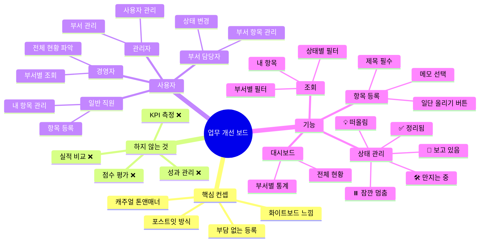
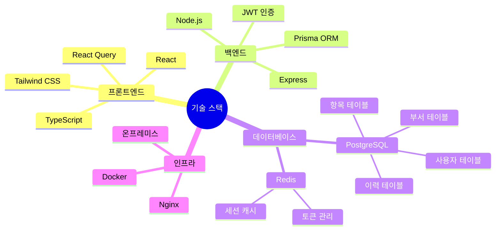
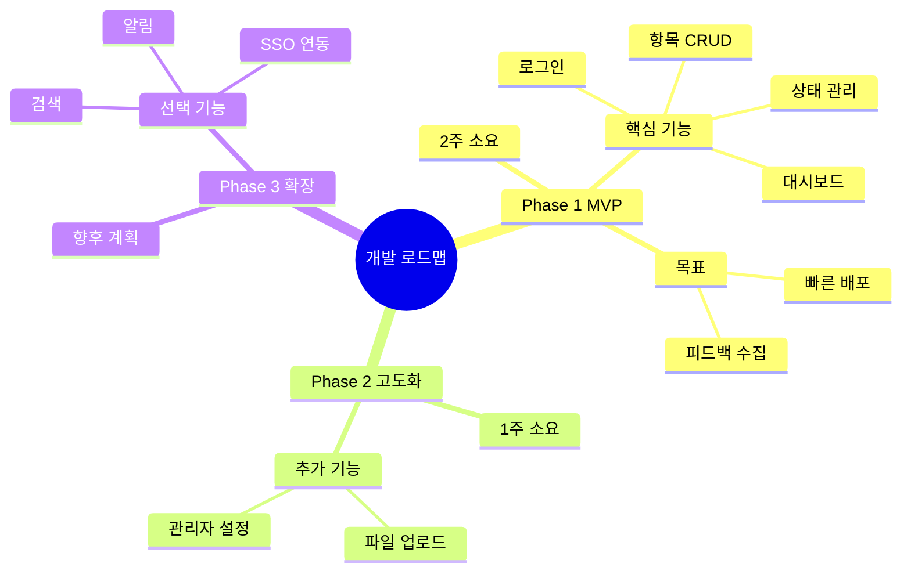
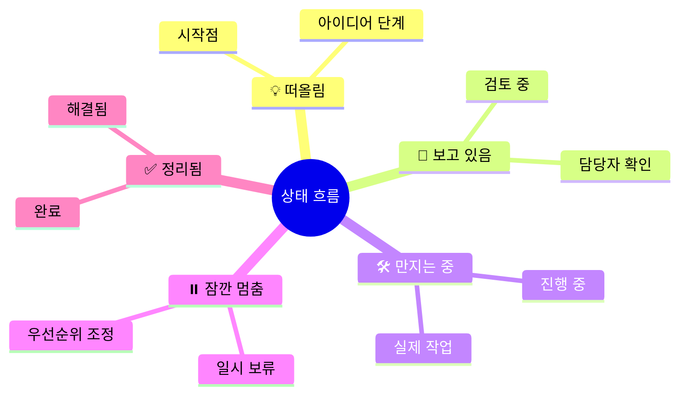

# 마인드맵
## 업무 개선 보드 시스템

---

## 시스템 전체 구조

---

## 기술 스택

---

## 개발 단계

---

## 핵심 가치

| 키워드 | 설명 |
|--------|------|
| 가벼움 | 복잡한 절차 없이 바로 등록 |
| 투명성 | 전사 개선 현황 한눈에 파악 |
| 자율성 | 평가/점수 없이 자유롭게 |
| 협업 | 부서 간 아이디어 공유 |

---

## 상태 흐름 마인드맵

