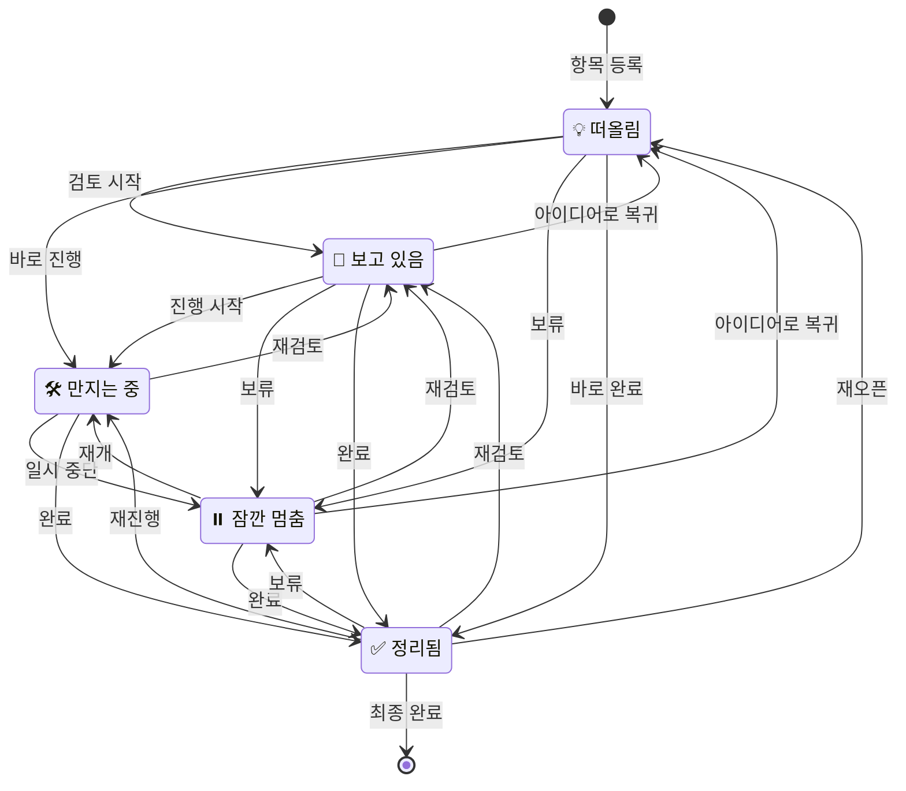

# 상태 다이어그램
## 업무 개선 보드 시스템

---

## 개선 항목 상태 흐름

---

## 상태 정의

| 상태 | 아이콘 | 영문 코드 | 색상 | 설명 |
|------|--------|-----------|------|------|
| 떠올림 | 💡 | IDEA | 노랑 (#FCD34D) | 아이디어 단계, 아직 시작 안함 |
| 보고 있음 | 👀 | REVIEWING | 파랑 (#60A5FA) | 누군가 검토 중 |
| 만지는 중 | 🛠️ | IN_PROGRESS | 초록 (#34D399) | 실제 작업 진행 중 |
| 잠깐 멈춤 | ⏸️ | ON_HOLD | 회색 (#9CA3AF) | 일시 보류, 나중에 다시 |
| 정리됨 | ✅ | DONE | 민트 (#2DD4BF) | 완료, 해결됨 |

---

## 상태 전이 규칙

### 허용된 전이

> 📌 모든 상태에서 다른 모든 상태로 전이 가능 (유연한 운영)

| 현재 상태 | 전이 가능 상태 |
|-----------|----------------|
| IDEA | REVIEWING, IN_PROGRESS, ON_HOLD, DONE |
| REVIEWING | IDEA, IN_PROGRESS, ON_HOLD, DONE |
| IN_PROGRESS | REVIEWING, ON_HOLD, DONE |
| ON_HOLD | IDEA, REVIEWING, IN_PROGRESS, DONE |
| DONE | IDEA, REVIEWING, IN_PROGRESS, ON_HOLD |

### 제한 사항

- ❌ 같은 상태로 전이 불가 (IDEA → IDEA)
- ✅ 상태 변경 시 이력 자동 기록
