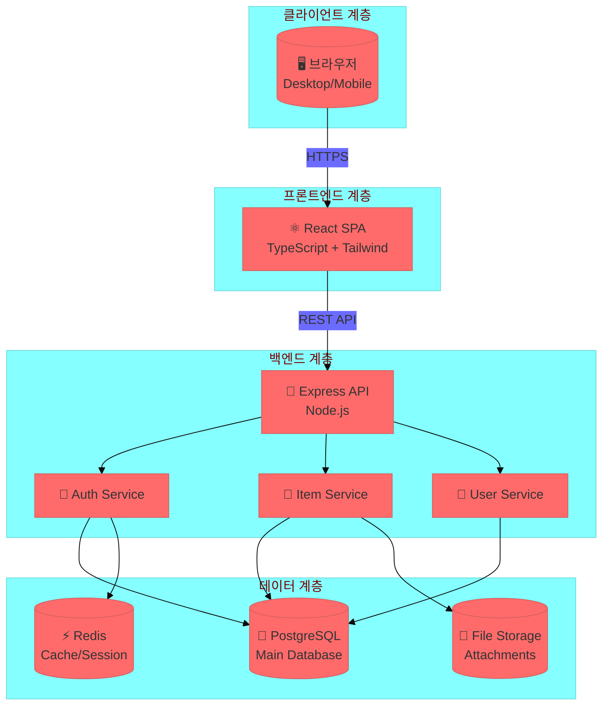

# 시스템 구조도
## 업무 개선 보드 시스템

---

## 시스템 아키텍처 다이어그램

---

## 계층 설명

| 계층 | 구성요소 | 역할 |
|------|----------|------|
| 클라이언트 | 브라우저 | 사용자 인터페이스 |
| 프론트엔드 | React SPA | UI 렌더링, 상태 관리 |
| 백엔드 | Express API | 비즈니스 로직, 인증 |
| 데이터 | PostgreSQL, Redis | 데이터 저장, 캐싱 |

---

## 데이터 흐름

1. **사용자** → 브라우저에서 요청
2. **React SPA** → API 호출 (REST)
3. **Express API** → 서비스 레이어 처리
4. **서비스** → 데이터베이스 조회/저장
5. **응답** → 역순으로 반환
