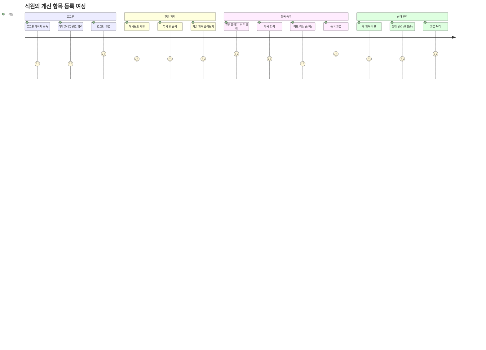

# 사용자 여정 맵
## 업무 개선 보드 시스템

---

## 직원의 개선 항목 등록 여정

---

## 여정 단계별 설명

### 1️⃣ 로그인

| 단계 | 행동 | 만족도 | 개선 포인트 |
|------|------|--------|-------------|
| 페이지 접속 | URL 입력 | 3 | 북마크 안내 |
| 자격증명 입력 | 이메일/비밀번호 | 3 | 비밀번호 저장 |
| 로그인 완료 | 대시보드 이동 | 5 | - |

### 2️⃣ 현황 파악

| 단계 | 행동 | 만족도 | 개선 포인트 |
|------|------|--------|-------------|
| 대시보드 확인 | 전체 현황 조회 | 4 | - |
| 부서 탭 클릭 | 부서별 필터링 | 4 | - |
| 훑어보기 | 기존 항목 확인 | 4 | 검색 기능 (Phase 3) |

### 3️⃣ 항목 등록

| 단계 | 행동 | 만족도 | 개선 포인트 |
|------|------|--------|-------------|
| 버튼 클릭 | [일단 올리기] | 5 | 친근한 문구 ✅ |
| 제목 입력 | 불편 사항 작성 | 4 | - |
| 메모 작성 | 상세 내용 (선택) | 3 | 필수 아님 ✅ |
| 등록 완료 | 카드 생성 | 5 | 즉시 피드백 |

### 4️⃣ 상태 관리

| 단계 | 행동 | 만족도 | 개선 포인트 |
|------|------|--------|-------------|
| 내 항목 확인 | 내가 등록한 항목 | 4 | - |
| 상태 변경 | 아이콘 클릭 | 4 | 직관적 UI ✅ |
| 완료 처리 | ✅ 정리됨 | 5 | 성취감 |

---

## 핵심 터치포인트

### 긍정적 경험 (만족도 5)

- ✅ 로그인 완료 → 대시보드 바로 이동
- ✅ [일단 올리기] → 부담 없는 등록
- ✅ 등록 완료 → 즉시 카드 표시
- ✅ 완료 처리 → 성취감

### 개선 필요 (만족도 3)

- 🔄 메모 작성 → 선택 사항으로 부담 최소화
- 🔄 로그인 → 비밀번호 저장/SSO (Phase 3)

---

## 페르소나별 여정

### 👤 일반 직원
- 목표: 불편한 점 쉽게 등록
- 핵심 행동: 등록 → 상태 관리

### 👔 부서 담당자
- 목표: 부서 내 항목 관리
- 핵심 행동: 필터링 → 상태 변경 → 진행 관리

### 🏢 경영자
- 목표: 전사 현황 파악
- 핵심 행동: 대시보드 조회 → 부서별 확인 → 오래된 항목 확인
