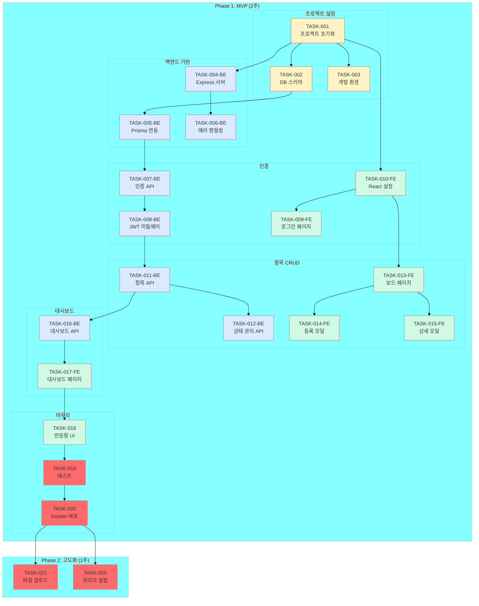

# 작업 의존성 그래프
## 업무 개선 보드 시스템

---

## 작업 흐름 다이어그램



---

## 의존성 매트릭스

### Phase 1: MVP

| 작업 | 선행 작업 | 후행 작업 |
|------|-----------|-----------|
| TASK-001 (프로젝트 초기화) | - | TASK-002, 003, 004, 010 |
| TASK-002 (DB 스키마) | TASK-001 | TASK-005 |
| TASK-003 (개발 환경) | TASK-001 | - |
| TASK-004 (Express 서버) | TASK-001 | TASK-006 |
| TASK-005 (Prisma 연동) | TASK-002 | TASK-007 |
| TASK-006 (에러 핸들링) | TASK-004 | - |
| TASK-007 (인증 API) | TASK-005 | TASK-008 |
| TASK-008 (JWT 미들웨어) | TASK-007 | TASK-011 |
| TASK-009 (로그인 페이지) | TASK-010 | - |
| TASK-010 (React 설정) | TASK-001 | TASK-009, 013 |
| TASK-011 (항목 API) | TASK-008 | TASK-012, 016 |
| TASK-012 (상태 관리 API) | TASK-011 | - |
| TASK-013 (보드 페이지) | TASK-010 | TASK-014, 015 |
| TASK-014 (등록 모달) | TASK-013 | - |
| TASK-015 (상세 모달) | TASK-013 | - |
| TASK-016 (대시보드 API) | TASK-011 | TASK-017 |
| TASK-017 (대시보드 페이지) | TASK-016 | TASK-018 |
| TASK-018 (반응형 UI) | TASK-017 | TASK-019 |
| TASK-019 (테스트) | TASK-018 | TASK-020 |
| TASK-020 (Docker 배포) | TASK-019 | TASK-021, 025 |

### Phase 2: 고도화

| 작업 | 선행 작업 | 후행 작업 |
|------|-----------|-----------|
| TASK-021 (파일 업로드) | TASK-020 | - |
| TASK-025 (관리자 설정) | TASK-020 | - |

---

## 크리티컬 패스

```
TASK-001 → TASK-002 → TASK-005 → TASK-007 → TASK-008 
    → TASK-011 → TASK-016 → TASK-017 → TASK-018 
    → TASK-019 → TASK-020
```

**총 예상 일수**: 약 10일 (크리티컬 패스 기준)

---

## 병렬 실행 가능 작업

| 시점 | 병렬 가능 작업 |
|------|----------------|
| TASK-001 완료 후 | TASK-002, 003, 004, 010 |
| TASK-010 완료 후 | TASK-009, 013 |
| TASK-013 완료 후 | TASK-014, 015 |
| TASK-020 완료 후 | TASK-021, 025 |

---

## 색상 범례

| 색상 | 의미 |
|------|------|
| 🟡 노랑 | 프로젝트 설정 |
| 🔵 파랑 | 백엔드 작업 |
| 🟢 초록 | 프론트엔드 작업 |
| ⚪ 회색 | 완료된 작업 |
